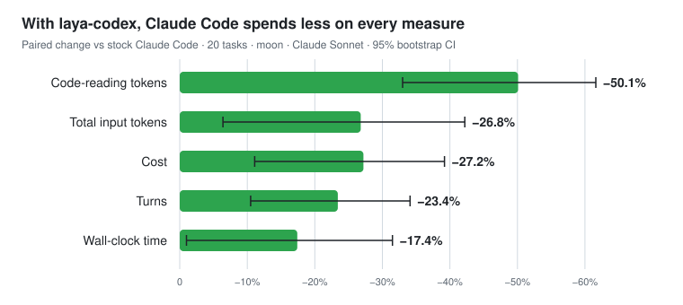
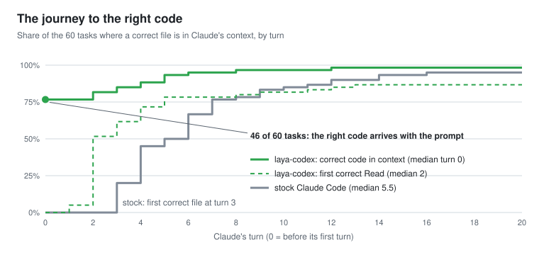
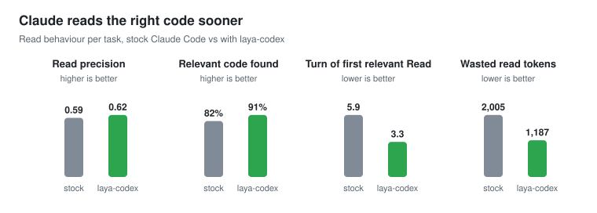

<div align="center">

# laya-codex

**Claude Code finds the right code faster, and reads half as much to get there.**

laya indexes your repository on your machine and, before Claude starts each task, gives it the
code that task needs. Claude skips most of the grep-and-open-files hunt.

[](https://github.com/pilotspace/laya-codex/releases/latest)
[](https://github.com/pilotspace/laya-codex/actions/workflows/ci.yml)
[](LICENSE)
[](https://huggingface.co/tindang/laya-code)
[](#install)

<picture>
  <source media="(prefers-color-scheme: dark)" srcset="docs/assets/benchmark-savings-dark.svg">
  
</picture>

</div>

## Install

**macOS (Apple Silicon)** or **Linux x86_64**. Installation takes about a minute, plus the model download on macOS.

**1. Install the `laya` binary**

```sh
curl -fsSL https://raw.githubusercontent.com/pilotspace/laya-codex/main/install.sh | sh
```

**2. Turn it on in Claude Code**, for every repository at once:

```
/plugin marketplace add pilotspace/laya-codex
/plugin install laya-codex@laya-codex
```

That's it. Open Claude Code in any git repository: laya indexes it in the background and starts
helping from the next prompt. To check the setup, run `laya doctor --repo .`.

<details>
<summary>Other ways to set it up</summary>

- **One repository only, without the plugin:** `laya init --repo /path/to/repo` writes laya's hooks into
  that repository's `.claude/settings.local.json` and its MCP server into `.mcp.json`.
- **Share with your team:** choose *project* scope when you run `/plugin install`. That records
  the plugin in `.claude/settings.json`.
- **Homebrew:** installs the same prebuilt binaries. The model is a separate step:
  ```sh
  brew install pilotspace/tap/laya-codex
  curl -fsSL https://raw.githubusercontent.com/pilotspace/laya-codex/main/install.sh | sh -s -- --model-only
  ```
- **Installer options:**
  - `--model-only` fetches and verifies only the model and leaves the binaries alone; use it after `brew install`;
  - `--version vX.Y.Z` installs a specific release;
  - `--dir DIR` installs somewhere other than `~/.local/bin`;
  - `--no-model` skips the ~850 MB model, and laya ranks by keywords alone;
  - `--model` downloads the model on Linux too, where it runs on the CPU and is slow.
- **Build from source:** see [Building from source](#building-from-source).

</details>

## What changes for Claude

Without laya, Claude starts every task by searching: grep, open a file, open another. With
laya, the relevant code is already in the conversation when Claude starts. This is a real
excerpt of what laya adds for the prompt *"Where does laya decide that a Moon server is safe to
use, and what happens if it answers without a password?"* in this repository:

````markdown
Ranked locations:
1. crates/laya-cli/src/doctor.rs — 107-148 fn check_auth
2. crates/laya-store/src/conn.rs — 142-178 impl Executor > fn verify_server
3. crates/laya-store/src/supervisor.rs — 276-306 fn stop; 119-158 impl MoonSupervisor; …
4. crates/laya-cli/src/config.rs — 186-229

### crates/laya-store/src/conn.rs:142-178 — impl Executor > fn verify_server
```rust
    /// With a password configured, refuse a server that answers anonymous clients: Moon without
    /// a password accepts any `AUTH`, so a successful `AUTH` alone does not prove the server is
    /// laya's. Runs once per new connection (pooled connections are reused).
    …
```
````

Claude then answers from the right functions, with far fewer file reads. Over the whole
benchmark, a correct file was already in Claude's context before its first turn in 15 of 20
tasks. Stock Claude Code first reached one at turn 4 at the earliest, with a median of 6.5:

<picture>
  <source media="(prefers-color-scheme: dark)" srcset="docs/assets/benchmark-journey-dark.svg">
  
</picture>

<picture>
  <source media="(prefers-color-scheme: dark)" srcset="docs/assets/benchmark-reads-dark.svg">
  
</picture>

## Why you might want it

- **Lower bills and longer sessions.** Claude reads about half as many code tokens, so it
  costs 27% less per task and uses up the context window more slowly.
- **Faster answers.** 23% fewer turns and 17% less wall-clock time per task, because
  Claude doesn't have to search for the code first.
- **Nothing to learn.** It runs through Claude Code's own hooks. You keep prompting as usual.
- **Everything stays on your machine.** Indexing and ranking run locally, with no server, account or
  telemetry. Only the code laya adds to a prompt goes to Anthropic, the same way code Claude
  reads with its own tools does.
- **It can't break Claude Code.** Every hook fails open: if laya is missing, stopped or
  slow, Claude Code carries on exactly as it would without it.

## Benchmark

We compared stock Claude Code with Claude Code plus laya on 20 real code-change tasks held out
from training. The tasks come from the history of [pilotspace/moon](https://github.com/pilotspace/moon), a Rust
database. Each session asks two questions, both arms use the same model (Claude Sonnet), and
all numbers are paired with 95% bootstrap confidence intervals.

| vs stock Claude Code | change | 95% CI |
|---|---|---|
| Code-reading tokens | **−50.1%** | −61.6% … −33.0% |
| Total input tokens | −26.8% | −42.2% … −6.4% |
| Cost | −27.2% | −39.2% … −11.1% |
| Turns | −23.4% | −34.1% … −10.5% |
| Wall-clock time | **−17.4%** | −31.5% … −1.0% |
| Answer recall | 0.933 vs 0.975 | difference −0.042 … 0.000, not significant |

**Limits of this result:**
- **One repository and 20 tasks.** A three-repository benchmark (Rust, Python, TypeScript) is in progress.
- **Time goal not met.** Our target is −30% wall-clock, and this run reached −17%.
- **Model vs keywords not separated yet.** With 20 tasks, the benchmark can't tell how much the Laya model adds over plain keyword ranking.

Full method, ablations and raw data: [docs/RESULTS.md](docs/RESULTS.md). To regenerate the
charts: `python3 scripts/charts.py bench/results/headline-v7.json docs/assets`.

## How it works

```
your prompt ─► laya hook ─► local daemon ─► BM25 keyword search + symbol and path matches
                                   │            (Moon index, tree-sitter chunks of 10–50 lines)
                                   ├─► Laya re-ranker: "is this code relevant to this task?"
                                   ▼
          ≤ 9,500 chars added to the prompt: a ranked map, the code of the top 3 files,
          definitions and uses of the names in your prompt, and related callers and callees
```

- **Indexing.** laya splits your code into 10–50-line chunks along function and class boundaries using
  [tree-sitter](https://tree-sitter.github.io/), for 14 languages. Moon, a small local search server that
  laya runs for you, stores the chunks. Edits are re-indexed as Claude makes them.
- **Ranking.** Keyword search picks the 24 best candidates. The [laya-code](https://huggingface.co/tindang/laya-code) model,
  a code-tuned [Laya](https://huggingface.co/convaiinnovations/laya) model running on the Metal GPU, scores
  how relevant each one is to your task, and the two rankings are blended. If the model is busy
  or absent, laya falls back to keyword ranking alone.
- **Adding code without repeating it.** laya remembers what the session has already seen, so a
  follow-up prompt doesn't get the same code twice. The first whole-file Read of a large file returns
  the most relevant region plus an outline; reading the file again returns all of it.
- **Follow-up search.** Claude also gets an MCP tool, `laya_search`, for follow-up lookups.

What gets injected, when and why, with real hook input and output:
[docs/how-it-works.md](docs/how-it-works.md). Design and decisions:
[docs/architecture.md](docs/architecture.md).

## FAQ

<details>
<summary><b>What does it cost to run?</b></summary>

- **Money:** nothing. laya is free and runs locally, and it lowers what you pay Claude (−27% per task in the benchmark).
- **Disk:** about 45 MB for the binaries and about 850 MB for the model.
- **Memory:** the daemon uses about 1 GB of RAM while it is running.

</details>

<details>
<summary><b>Which languages and platforms are supported?</b></summary>

- **Languages:** Rust, Python, TypeScript, TSX, JavaScript, Go, Java, C, C++, C#, Ruby, PHP, Kotlin and Swift.
- **macOS on Apple Silicon:** the full experience, with the model on the Metal GPU.
- **Linux x86_64:** keyword ranking only by default. The model runs on the CPU there, which is too slow to be useful.
- **Other platforms:** build from source.

</details>

<details>
<summary><b>Is my code sent anywhere?</b></summary>

laya itself makes no network calls after installation. The index, the model and the daemon all
live in `~/.cache/laya-codex`, which only your user can read, and the local search server
requires a password that laya generates. The code snippets laya adds to a prompt reach
Anthropic as part of your Claude Code conversation, exactly like code Claude reads with its own
tools.

</details>

<details>
<summary><b>Will it get in Claude's way?</b></summary>

- **It never blocks a tool call** and never fails a prompt: every hook fails open.
- **The first time Claude reads a whole large file**, it gets the relevant region plus an outline; asking again returns the whole file.
- **Only git repositories are indexed automatically.** Opening Claude Code in your home directory indexes nothing.

</details>

<details>
<summary><b>How do I uninstall it?</b></summary>

```sh
laya stop
rm -f ~/.local/bin/laya ~/.local/bin/moon
rm -rf ~/.cache/laya-codex
```

Then, inside Claude Code, run `/plugin uninstall laya-codex@laya-codex`. If you used `laya init`,
also remove laya's entries from that repository's `.claude/settings.local.json` and `.mcp.json`.

</details>

<details>
<summary><b>Something isn't working</b></summary>

Run `laya doctor --repo .`. It checks the binary, the search server and its password, the
model, the daemon, the index and the hooks, and prints a fix for anything that fails. If that
doesn't help, [open an issue](https://github.com/pilotspace/laya-codex/issues) and include its
output.

</details>

## Roadmap

- **v0.1.2, current:** the Claude Code plugin, plus crash isolation and daemon limits.
- **Next:**
  - a Homebrew formula;
  - benchmark v2 across three repositories and languages;
  - closing the gap from −17% to the −30% time goal;
  - a faster model for Linux.

See [ROADMAP.md](ROADMAP.md) for the full plan to 1.0.

## Reference

<details>
<summary><b>Commands</b></summary>

```sh
laya init --repo /path/to/repo      # add hooks and the MCP server to one repository, then index it
laya doctor --repo /path/to/repo    # check everything; prints a fix for each problem (--json available)
laya index /path/to/repo            # incremental; re-run any time
laya query "where is WAL replay implemented" --repo /path/to/repo
laya status | laya stop
```

`laya init` merges laya's hooks and MCP server into the repository's settings:
- **It keeps everything else:** every other key, hook and server is left alone.
- **Re-running it is safe:** a second run changes nothing.
- **It writes the bare `laya` command** when `laya` on `PATH` is the binary you ran.
- **It refuses symlinks:** it won't write through a symlinked `.claude` directory or settings file.

Flags:
- `--dry-run` prints the result without writing anything.
- `--no-index` skips indexing.
- `--force` replaces a settings file that isn't valid JSON; the original is kept as `*.bak`.

</details>

<details>
<summary><b>Configuration (environment variables)</b></summary>

| var | default | meaning |
|---|---|---|
| `LAYA_HOME` | `~/.cache/laya-codex` | socket, logs, Moon data and password (`moon.acl`), models (mode 0700) |
| `LAYA_MODEL_DIR` | `laya-code`, else `laya-base` | model directory |
| `LAYA_NO_MODEL` | unset | `1` = lexical-only ranking |
| `LAYA_BUDGET_MS` | `1200` | Laya time budget per prompt (falls back to lexical) |
| `LAYA_RENDER` | `compact` | `full` injects every span's code |
| `LAYA_WEIGHT` / `LAYA_STATE_TOKENS` / `LAYA_K` / `LAYA_P_THRESHOLD` | `0.5` / `128` / `24` / `0` | ranking knobs (daemon start) |
| `LAYA_ADAPTIVE` | on | `0` = fixed compact injection; default skips code already sent or read in the session |
| `LAYA_SCOPE` | off | `1` = let a Laya scope classifier size the injection (measured no-op; see RESULTS) |
| `LAYA_MOON_START_SECS` | `30` | how long a freshly started Moon may take to answer |
| `LAYA_MOON_PORT` / `LAYA_MOON_BIN` | `16379` / `moon` beside `laya`, else on `PATH` | Moon sidecar; a missing binary is reported with every path tried |
| `LAYA_BIN` | unset | the `laya` binary the Claude Code plugin should use |

</details>

<details>
<summary><b>Manual hook setup (what <code>laya init</code> writes)</b></summary>

`.claude/settings.local.json`:

```json
{
  "hooks": {
    "SessionStart":     [{"hooks": [{"type": "command", "command": "laya hook", "timeout": 5}]}],
    "UserPromptSubmit": [{"hooks": [{"type": "command", "command": "laya hook", "timeout": 8}]}],
    "PreToolUse":  [{"matcher": "Read|Agent|Task", "hooks": [{"type": "command", "command": "laya hook", "timeout": 5}]}],
    "PostToolUse": [{"matcher": "Edit|Write|MultiEdit|NotebookEdit", "hooks": [{"type": "command", "command": "laya hook", "timeout": 5}]}]
  }
}
```

and `.mcp.json`: `{"mcpServers": {"laya": {"command": "laya", "args": ["mcp"]}}}`.

</details>

<details id="building-from-source">
<summary><b>Building from source</b></summary>

Requirements:
- **Rust:** 1.90+ (edition 2024).
- **Moon:** a [Moon](https://github.com/pilotspace/moon) binary built with its `text-index` feature. laya looks for it beside the `laya` binary, then on `PATH`, then at `LAYA_MOON_BIN`.
- **Model weights (optional):** `hf download tindang/laya-code --local-dir ~/.cache/laya-codex/models/laya-code`. Without them, laya ranks by keywords alone.

```sh
cargo build --release -p laya-cli        # target/release/laya (fat LTO, mimalloc, Metal on macOS)
cargo test --workspace --release
```

</details>

<details>
<summary><b>Reproducing the benchmark</b></summary>

```sh
python3 bench/run_bench.py tasks --repo <moon clone> --skip 40 --n 20 --out bench/tasks.jsonl
laya index <moon clone>
python3 bench/run_bench.py run --repo <moon clone> --tasks bench/tasks.jsonl \
    --arms baseline,laya-adaptive --turns 2 --out /tmp/bench-run
python3 bench/stats.py /tmp/bench-run laya-adaptive
python3 bench/read_accuracy.py /tmp/bench-run bench/tasks.jsonl
```

</details>

<details>
<summary><b>Repository layout</b></summary>

| path | what |
|---|---|
| `crates/laya-core` | shared types, `Store`/`Scorer` contracts, code-aware term splitting |
| `crates/laya-parse` | tree-sitter (14 languages) cAST chunker, symbols, repo walk |
| `crates/laya-store` | Moon RESP store: OR-BM25 fan-out, circuit breaker, supervisor, auth |
| `crates/laya-model` | Laya (ModernBERT-large + decision head) in candle, parity-tested |
| `crates/laya-rank` | candidate generation, Laya gate, fusion, span shaping, rendering |
| `crates/laya-cli` | `laya` binary: daemon, hooks, MCP, indexer, init, doctor |
| `plugin/`, `.claude-plugin/` | the Claude Code plugin and its marketplace entry |
| `install.sh`, `scripts/` | installer, chart generator, installer and plugin tests (run in CI) |
| `finetune/`, `spike/` | Laya fine-tuning and the zero-shot spike (Python) |
| `bench/` | paired Claude Code benchmark, retrieval eval, results |

</details>

## License

[Apache-2.0](LICENSE). Moon, the search server laya runs, is distributed under its own license
(shipped with its binary). The laya-code model is Apache-2.0 on
[Hugging Face](https://huggingface.co/tindang/laya-code). Third-party notices:
[NOTICE](NOTICE) and [docs/release/LICENSES.md](docs/release/LICENSES.md).
