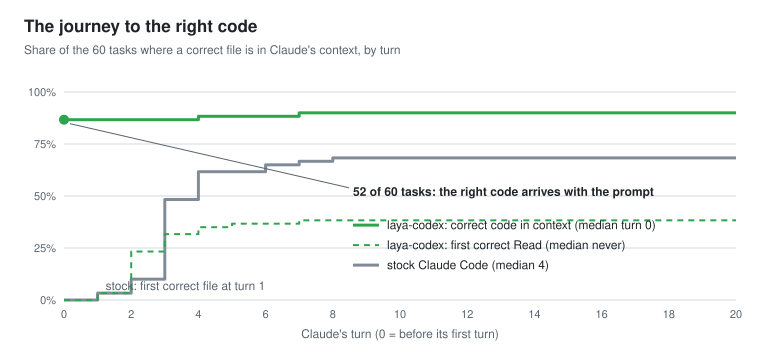
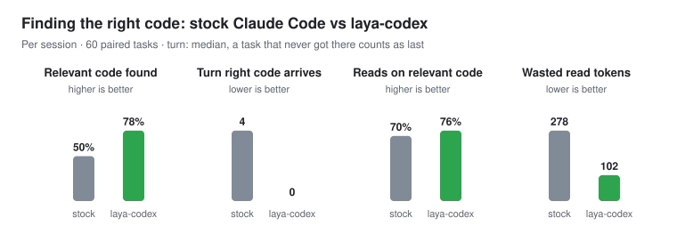
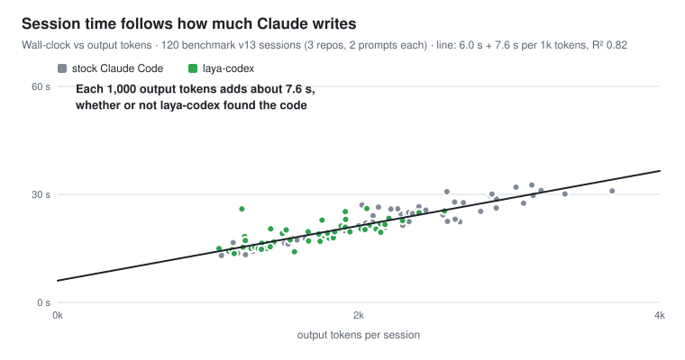
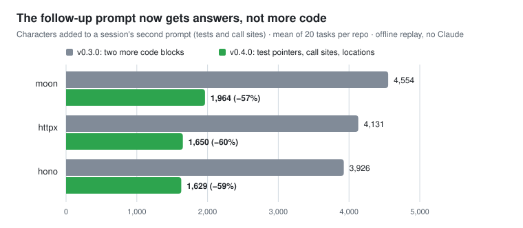

<div align="center">

# laya-codex

### Claude Code gets the right code with your prompt, so it stops hunting for it.

laya-codex indexes your repository locally and hands Claude the code each task needs, before its first turn.

[](https://github.com/pilotspace/laya-codex/releases/latest)
[](https://github.com/pilotspace/laya-codex/actions/workflows/ci.yml)
[](LICENSE)
[](https://huggingface.co/tindang/laya-code)
[](#install)

| **−14.8%** | **−19%** | **5.9 → 2.3** | **73% → 88%** |
|:---:|:---:|:---:|:---:|
| cost per session | time per session | tool calls per session | right files in Claude's first answer |

<sub>Benchmark v13 vs stock Claude Code · 60 paired tasks · 3 repositories · Claude Sonnet 5.5 · 95% CI.
Trade-off: code read + injected +10% (not significant). On 60 new tasks (v14): cost −3% (not
significant), time −12%, first answers 73% → 83%. <a href="#benchmark">Details</a></sub>

**[Install](#install)** · **[What changes](#what-changes-for-claude)** · **[How it works](#how-it-works)** · **[Benchmark](#benchmark)** · **[FAQ](#faq)**

</div>

## What changes for Claude

<picture>
  <source media="(prefers-color-scheme: dark)" srcset="docs/assets/diagram-session-dark.svg">
  
</picture>

<picture>
  <source media="(prefers-color-scheme: dark)" srcset="docs/assets/benchmark-journey-dark.svg">
  
</picture>

**Example.** *"Bug: `init` writes through a symlinked `.claude` folder into another repo. Find the
check and fix it."* Stock Claude greps for the check; with laya-codex, Claude's first turn already
has `check_target`, its code and its caller.

<details>
<summary>What laya-codex added to that prompt</summary>

````markdown
Ranked locations:
1. crates/laya-cli/src/init.rs — 394-425 fn apply; 285-325 fn check_target; …

### crates/laya-cli/src/init.rs:394-425 — fn apply
```rust
pub fn apply(p: &Planned) -> anyhow::Result<()> { …
```

Definitions and uses:
- crates/laya-cli/src/init.rs:288: fn check_target(root: &Path, root_canon: &Path, path: &Path) … — definition of `check_target`
- crates/laya-cli/src/init.rs:472: check_target(root, &root_canon, path)?; — use of `check_target`
````

</details>

More in [docs/use-cases.md](docs/use-cases.md): follow-ups, impact analysis, unfamiliar codebases,
subagents, and where it helps less.

## Why you might want it

| | |
|---|---|
| **Right code first** | The code arrives with the prompt: 2.3 tool calls instead of 5.9. |
| **Faster, often cheaper** | −19% time, −32% input and −26% output tokens per session; cost −14.8% (−3%, not significant, on new tasks). |
| **Better first answers** | Right files named 73% → 88% on the first question (no significant change over both). |
| **Nothing to learn** | Runs through Claude Code's hooks; you prompt as usual. |
| **Local** | No server, account or telemetry. Only injected code reaches Anthropic, like Claude's own reads. |
| **Fail-open** | If laya-codex is missing, stopped or slow, Claude Code carries on unchanged. |

The trade-off: about 2.9k injected tokens per session, so code read + injected is +10%
([limits](#what-limits-this-result-and-what-is-next)).

## Install

**macOS (Apple Silicon)** or **Linux x86_64**, about a minute plus the model download on macOS.

```sh
# 1. the binary
curl -fsSL https://raw.githubusercontent.com/pilotspace/laya-codex/main/install.sh | sh
```

```
# 2. in Claude Code, for every repository
/plugin marketplace add pilotspace/laya-codex
/plugin install laya-codex@laya-codex
```

Open Claude Code in any git repository; it indexes in the background and helps from the next
prompt. Check the setup with `laya-codex doctor --repo .`.

<details>
<summary>Other ways to set it up</summary>

- **One repository, no plugin:** `laya-codex init --repo /path/to/repo` writes hooks to
  `.claude/settings.local.json` and the MCP server to `.mcp.json`.
- **For your team:** pick *project* scope in `/plugin install` (records it in `.claude/settings.json`).
- **Homebrew** (same binaries; the model is a separate step):
  ```sh
  brew install pilotspace/tap/laya-codex
  curl -fsSL https://raw.githubusercontent.com/pilotspace/laya-codex/main/install.sh | sh -s -- --model-only
  ```
- **Installer options:** `--model-only` (model only, after `brew install`) · `--version vX.Y.Z` ·
  `--dir DIR` (default `~/.local/bin`) · `--no-model` (skip the ~330 MB model; keyword ranking) ·
  `--model` (also on Linux, where it runs slowly on the CPU).
- **From source:** see [Building from source](#building-from-source).

</details>

## How it works

<picture>
  <source media="(prefers-color-scheme: dark)" srcset="docs/assets/diagram-pipeline-dark.svg">
  
</picture>

- **Index:** [tree-sitter](https://tree-sitter.github.io/) chunks stored in Moon, a local search
  server laya-codex runs for you; edits are re-indexed as Claude makes them.
- **Rank:** [laya-code](https://huggingface.co/tindang/laya-code/tree/r2) re-ranks keyword
  candidates within a time budget. A busy machine re-ranks fewer; with no model, keywords rank alone.
- **No repeats:** follow-ups skip code already sent or read whole. Claude's own Reads are never changed.
- **`search` tool:** one MCP call returns a name's definition, callers and tests, with a note on
  whether the list is complete; a description returns ranked code.

Details: [docs/how-it-works.md](docs/how-it-works.md) (real hook input and output) ·
[docs/architecture.md](docs/architecture.md) (design and decisions).

### Why a Laya model on top of keyword search?

Keywords rank by shared words: a function that mentions `password` five times beats the one that
decides whether a server is trusted. [Laya](https://huggingface.co/convaiinnovations/laya) judges
relevance instead, on the few candidates keywords find:

<picture>
  <source media="(prefers-color-scheme: dark)" srcset="docs/assets/diagram-rerank-dark.svg">
  
</picture>

- **Direct judgment:** a cross-encoder reads task and code together and returns *P(relevant)*,
  more precise than comparing separate embeddings.
- **Cheap:** it scores candidates only, so indexing needs no model or vector database (Moon's
  source: 485 files in about 1.2 s).
- **Tuned for code:** base Laya ranks code no better than keywords; laya-code is fine-tuned on git
  history, where a commit's changed code is the answer to its message.

Ranking the files real changes touched (40 recent Moon commits, 24 candidates each):

| ranking | MRR ↑ | P@10 ↑ | calibration error ↓ |
|---|---|---|---|
| keyword search (BM25) | 0.480 | 0.340 | – |
| base Laya | 0.479 | 0.348 | 0.362 |
| **laya-code** | **0.702** | **0.405** | **0.049** |

**No end-to-end gain yet:** better ranking has not shown up as lower cost or better recall in
sessions (benchmarks v10, v12). It stays on because choosing the code is what laya-codex is for;
closing that gap tops the roadmap. Keywords only: `LAYA_CODEX_NO_MODEL=1` or `--no-model`.

<details>
<summary>Model versions and the model-vs-keywords evidence</summary>

- **Installed model:** laya-code-r2, the `r2` branch of
  [tindang/laya-code](https://huggingface.co/tindang/laya-code/tree/r2): a ModernBERT-base
  re-ranker trained on the same candidate lists as r1, served at 128 tokens per candidate with the
  top 12 scored. In the offline replay (tasks-v8 and held-out tasks, 120 first prompts) it inlines
  141 of 238 gold files against 132 for r1 and 118 for keywords, and the hook takes 165 ms (p50)
  instead of 517 ms. It installs to `models/laya-code-r2`. An existing r1 install in
  `models/laya-code` keeps working, and `laya-codex doctor` shows the upgrade command.
- **Previous model:** revision `25f97e5` on the `r1` branch, retrained on fixed commits
  of 7 repositories using laya-codex's own candidate lists; benchmark and evaluation repositories
  excluded. The table above measures the first model (`f3d6bd2`,
  [card](https://huggingface.co/tindang/laya-code/tree/f3d6bd2344e4750dd917f95d40ceacfa81bb81db)),
  which the repository's `main` branch still holds.
- **Offline replay:** r1 inlines 70 of 115 gold files vs 63 (first model) and 62 (keywords)
  ([card](https://huggingface.co/tindang/laya-code/blob/r1/README.md)). Dev-set MRR: blend 0.724,
  model alone 0.602, model weighted higher 0.678.
- **Benchmark v10** (keyword-only arm, model ranked all 102 prompts, 51 tasks): nothing
  significant. Cost −4.0% (−11.2% … +4.3%), read + injected −1.6% (−11.1% … +8.2%), wall-clock
  −4.2% (−19.1% … +12.3%), first-question recall 0.90 vs 0.91.
- **Benchmark v12** (Sonnet 5.5, 60 tasks): cost −0.2% (−3.1% … +2.9%), recall 0.90 vs 0.88, time
  +5% (+1.0% … +9.9%) with the model. 51–60 tasks are too few to show the offline gain.
- **Benchmark v2** found the model 13% slower but did not record how many prompts it ranked
  ([caveat](docs/RESULTS.md#caveat-the-model-may-not-have-ranked-every-prompt)).

</details>

## Benchmark

60 real code-change tasks from [moon](https://github.com/pilotspace/moon) (Rust),
[httpx](https://github.com/encode/httpx) (Python) and [hono](https://github.com/honojs/hono)
(TypeScript), none used in training. Each task comes from a commit; one live session asks where
the change goes, then which tests cover it. Both arms: Claude Sonnet 5.5 (`claude-sonnet-5-5`),
medium effort, Claude Code 2.1.284. Benchmark v13 (2026-09-30): laya-codex 0.4.0 plus the
per-file candidate cap and request capture, laya-code-r1, all 60 tasks, no stalls. Paired, 95%
bootstrap CIs; grey = not significant.

<picture>
  <source media="(prefers-color-scheme: dark)" srcset="docs/assets/benchmark-savings-dark.svg">
  
</picture>

| per session | stock | laya-codex | change | 95% CI |
|---|---|---|---|---|
| Cost (goal −15%) | $0.081 | $0.069 | **−14.8%** | −18.8% … −10.4% |
| Code read + injected (tokens) | 4,297 | 4,743 | +10.4% | −0.6% … +23.3% |
| Code-reading tokens | 4,297 | 1,817 | **−57.7%** | −65.7% … −48.8% |
| Total input tokens | | | **−31.7%** | −37.3% … −25.0% |
| Output tokens | | | **−25.6%** | −28.9% … −22.2% |
| Wall-clock time (goal −20%) | 23.2 s | 18.7 s | **−19.2%** | −23.3% … −14.7% |
| Turns (tool calls + prompts) | 7.9 | 4.3 | **−45.5%** | −49.8% … −40.7% |
| Tool calls | 5.9 | 2.3 | | Grep 4.2 → 0.8; `search` 0.8 |
| Answer recall, first question | 0.73 | 0.88 | **+0.15** | +0.08 … +0.23 |
| Answer recall, both questions | 0.95 | 0.93 | −0.02 | −0.08 … +0.02 |

<picture>
  <source media="(prefers-color-scheme: dark)" srcset="docs/assets/benchmark-reads-dark.svg">
  
</picture>

### By repository

It helps most where code is hard to find. On httpx, stock Claude finds code in a few calls, so the
injection costs about what it saves:

| change vs stock | moon (Rust) | hono (TypeScript) | httpx (Python) |
|---|---|---|---|
| Cost (95% CI) | **−23.6%** (−29.3% … −16.9%) | **−11.8%** (−18.4% … −4.8%) | +1.3% (−7.4% … +11.7%), n.s. |
| Wall-clock time | **−28.7%** | **−20.5%** | −4.5%, n.s. |
| Turns | **−58.9%** | **−45.7%** | **−27.6%** |
| Code-reading tokens | **−72.4%** | **−45.6%** | **−39.2%** |
| Code read + injected | **−22.1%** | +31.0% | +58.8% |

Bold = significant improvement; the hono and httpx increases are significant too. Repositories
weighted equally: cost −11.4% (−15.5% … −6.7%), read + injected +22.6% (+10.7% … +37.7%).

### On new tasks

laya-codex was tuned on these 60 tasks from v8 to v13. Benchmark v14 ran 60 new ones
(`bench/tasks-heldout`) under the same model and harness:
- **Cost:** −3.4% (−9.7% … +3.6%), not significant. It fell only on moon (−12.5%).
- **Time and turns:** time −12.1% (−17.9% … −5.3%), turns −37.6%.
- **Right files on the first question:** 0.73 → 0.83 (+0.10, +0.04 … +0.16), no change over both.
- **Code read + injected:** +50.9%. Stock read less on these tasks while the injection kept its
  size.

The gains in turns, time and first answers hold; the cost saving mostly does not.
[Details](docs/RESULTS.md#benchmark-v14-2026-09-30-held-out-tasks-the-low-confidence-gate-does-nothing)

### Where the saving comes from

Fewer API calls (3.7 per session instead of 5.9), not less code: injected code replaces tool
output about one for one, and each avoided call saves re-reading the conversation. laya-codex's
bill at list prices: 64% cache writes, 12% cache re-reads, 24% output.

**Two benchmark bugs** ([write-up](docs/blog/2026-09-30-measuring-honestly.md)): resuming the
session per prompt made laya-codex pay prompt-cache misses (v12: cost +7.7%; v13 without it:
$0.087 → $0.069, stock unchanged at $0.081). And every session in both arms, v13 included, loaded
the operator's `~/.claude/CLAUDE.md` (found after this run, since fixed). Two more were found in
v14 and fixed:
- the harness counted prompt 1's cost twice (the costs here are re-derived);
- arms with the same system prompt shared Anthropic's prompt cache.

**Token counts re-derived (2026-10-07).** The harness counted code at 3.5 characters per token;
the cache writes Anthropic bills show Sonnet 5.5 spends 0.42–0.46 tokens per character of code
(`bench/runs.py`), so code read and code injected were both counted 1.5–1.6× too low. The
v12–v14 figures here are re-derived from the raw transcripts: token counts rose 1.5–1.6×, pooled
changes moved by about 1 point and per-repository ones by up to 2.1.

### What limits this result, and what is next

| limit | why | next |
|---|---|---|
| **Cost −14.8%**, goal −15% | Most of the bill is Claude Code's own context and Claude's answers, paid by both arms; even with zero lookups a session with today's injection costs about $0.053 (−34%) | Don't inject where stock is already cheap (httpx) |
| **New tasks (v14): cost −3.4%** (n.s.), read + injected +51% | Tuned on v13's tasks; stock reads less on new ones, the injection does not shrink with it | Judge changes on held-out tasks |
| **Read + injected +10.4%** (n.s.; +22.6% repo-balanced), goal: not significantly worse | ~2.9k injected tokens replace reading about one for one | Smaller blocks made Claude read more (v11); same httpx fix |
| **Time −19.2%**, goal −20% | Answers take about 12.4 s in both arms; the saving is all lookup round trips ([breakdown](docs/RESULTS.md)) | The small time levers, about −21% |
| **httpx cost +1%** (n.s.) | Stock already finds httpx code fast; all 8 first-prompt injections Laya scored below p 0.1 were httpx | — |
| **Model vs keywords**: no session difference | r1 wins offline (70 vs 62 of 115), not yet in v10/v12 ([details](#why-a-laya-model-on-top-of-keyword-search)) | — |
| **Scope**: find-and-explain tasks, one model per run | — | An edit-task pilot |

<details>
<summary>More charts: time follows output, follow-ups carry less code</summary>

<picture>
  <source media="(prefers-color-scheme: dark)" srcset="docs/assets/insight-time-dark.svg">
  
</picture>

<picture>
  <source media="(prefers-color-scheme: dark)" srcset="docs/assets/insight-followup-dark.svg">
  
</picture>

Regenerate:

```sh
cd scripts
python3 charts.py ../bench/results/headline-v13.json ../docs/assets
python3 diagrams.py ../docs/assets
python3 insight_charts.py ../bench/results/claude-v13 ../docs/assets --arm laya --run-label "benchmark v13" \
    --before ../bench/results/replay-2026-09-24/ab-rank.jsonl v030 v0.3.0 \
    --after ../bench/results/replay-2026-09-26-r1/replay.jsonl candidate v0.4.0
```

</details>

Full method, raw data and the next run: [docs/RESULTS.md](docs/RESULTS.md).

## FAQ

<details>
<summary><b>What does it cost to run?</b></summary>

- **Money:** free. Per session, Claude cost −14.8% in benchmark v13 and −3.4% (not significant) on
  new tasks in v14.
- **Disk:** about 45 MB of binaries plus the ~330 MB model.
- **Memory:** about 1 GB of RAM while the daemon runs.

</details>

<details>
<summary><b>Which languages and platforms are supported?</b></summary>

- **Languages:** Rust, Python, TypeScript, TSX, JavaScript, Go, Java, C, C++, C#, Ruby, PHP, Kotlin and Swift.
- **macOS on Apple Silicon:** everything, with the model on the Metal GPU.
- **Linux x86_64:** keyword ranking by default; the model is too slow on the CPU.
- **Other platforms:** build from source.

</details>

<details>
<summary><b>Is my code sent anywhere?</b></summary>

- **No network calls** after installation. Index, model and daemon live in `~/.cache/laya-codex`,
  readable only by you; the local search server needs a generated password.
- **What reaches Anthropic:** only the code laya-codex adds to a prompt, like code Claude reads itself.
- **Local ranking log:** each ranking appends one line to `~/.cache/laya-codex/capture/requests.jsonl`
  (prompt, session id, candidate files and line ranges with their scores, which blocks were inlined;
  never the code). It is never uploaded; it exists to measure real sessions and retrain the model.
  `laya-codex capture off` stops it at once, `laya-codex capture status` shows the state; delete
  the folder to erase it.

</details>

<details>
<summary><b>Will it get in Claude's way?</b></summary>

- **No:** every hook fails open; it never blocks a tool call or fails a prompt.
- It never changes Claude's own searches or Reads; it only notes which files Claude read.
- Only git repositories are indexed automatically, so your home directory is left alone.

</details>

<details>
<summary><b>How do I uninstall it?</b></summary>

```sh
laya-codex stop
rm -f ~/.local/bin/laya-codex ~/.local/bin/moon   # or: brew uninstall laya-codex
rm -rf ~/.cache/laya-codex
```

Then run `/plugin uninstall laya-codex@laya-codex` in Claude Code. If you used `laya-codex init`,
remove its entries from that repository's `.claude/settings.local.json` and `.mcp.json`.

</details>

<details>
<summary><b>Something isn't working</b></summary>

Run `laya-codex doctor --repo .`: it checks the binary, search server, model, daemon, index and
hooks, and prints a fix for each failure. To see what Claude Code and laya-codex exchanged:

```sh
laya-codex trace on                  # record every hook call and MCP message (off by default)
laya-codex trace show                # what was asked, what the daemon ranked, what went back
laya-codex trace show --full --last 1   # the exact JSON in and out, including the injected code
laya-codex trace show --follow       # watch live while you use Claude Code
laya-codex trace off && laya-codex trace clear
```

The trace stays in `~/.cache/laya-codex/trace/` (readable only by you) but holds your prompts and
code: review it before attaching it to an [issue](https://github.com/pilotspace/laya-codex/issues).

</details>

## Roadmap

**Next:**
- **Cost and tokens:** reach −15% per session (−14.8% on v13's tasks, −3.4% n.s. on new ones)
  without code read + injected rising, by
  not injecting where stock Claude Code is already cheap (httpx).
- **Time:** reach −20% (−19.2% now); answers are a fixed ~12.4 s, so only lookups and the hook can shrink.
- **Real sessions:** confirm the gains on locally recorded rankings, not just the benchmark.
- **Model:** turn r1's better offline ranking into a session-level gain (none yet in v10, v12).
- **Upkeep:** compact Moon's data log automatically (it reached 4.1 GB); a faster model for Linux.

See [ROADMAP.md](ROADMAP.md) for the full plan to 1.0.

<details>
<summary>Released so far</summary>

- **v0.4.0, current:**
  - `search` answers name lookups (definitions, callers, uses, tests), so Claude Greps 61% less;
  - the reranker is retrained on the candidates laya-codex ranks, and the installer pins it;
  - follow-up prompts get lists of tests and callers instead of more code;
  - the benchmark counts code injected as well as code read.
- **v0.3.0:**
  - ranking uses the task, not the instructions around it;
  - the model ranks within its time budget even under load;
  - trust labels on inlined code, and at most two inlined files;
  - `laya-codex trace` for debugging;
  - a nearly full disk no longer disables laya-codex silently.
- **v0.2.0:** one name everywhere: the CLI is `laya-codex` (was `laya`), env vars are
  `LAYA_CODEX_*`; a Homebrew formula; the plugin, crash isolation and daemon limits from 0.1.x.

Details: the [CHANGELOG](CHANGELOG.md).

</details>

## Reference

<details>
<summary><b>Commands</b></summary>

```sh
laya-codex init --repo /path/to/repo      # add hooks and the MCP server to one repository, then index it
laya-codex doctor --repo /path/to/repo    # check everything; prints a fix for each problem (--json available)
laya-codex index /path/to/repo            # incremental; re-run any time
laya-codex query "where is WAL replay implemented" --repo /path/to/repo
laya-codex status | laya-codex stop
laya-codex trace on|off|status|show|clear # record Claude Code <-> laya-codex exchanges for debugging
```

`laya-codex init` merges laya-codex's hooks and MCP server into the repository's settings:
- **It keeps everything else:** every other key, hook and server is left alone.
- **Re-running it is safe:** a second run changes nothing.
- **It writes the bare `laya-codex` command** when `laya-codex` on `PATH` is the binary you ran
  (after resolving symlinks, so a Homebrew install writes `laya-codex`, not a versioned Cellar path).
- **It refuses symlinks:** it won't write through a symlinked `.claude` directory or settings file.

Flags:
- `--dry-run` prints the result without writing anything.
- `--no-index` skips indexing.
- `--force` replaces a settings file that isn't valid JSON; the original is kept as `*.bak`.

</details>

<details>
<summary><b>Configuration (environment variables)</b></summary>

| var | default | meaning |
|---|---|---|
| `LAYA_CODEX_HOME` | `~/.cache/laya-codex` | socket, logs, Moon data and password (`moon.acl`), models (mode 0700) |
| `LAYA_CODEX_MODEL_DIR` | `laya-code-r2`, else `laya-code`, else `laya-base` (under `$LAYA_CODEX_HOME/models`) | model directory |
| `LAYA_CODEX_NO_MODEL` | unset | `1` = lexical-only ranking |
| `LAYA_CODEX_BUDGET_MS` | `1200` | Laya time budget per prompt: the model scores as many candidates as fit (lexical only if none) |
| `LAYA_CODEX_RENDER` | `compact` | `full` injects every span's code |
| `LAYA_CODEX_WEIGHT` / `LAYA_CODEX_K` / `LAYA_CODEX_P_THRESHOLD` | `0.5` / `24` / `0` | ranking knobs (daemon start) |
| `LAYA_CODEX_STATE_TOKENS` | the model's (`128`) | tokens of each candidate the model reads; overrides the `serving` block of the model's `rl_agent_config.json` |
| `LAYA_CODEX_ADAPTIVE` | on | `0` = fixed compact injection; default skips code already sent or read in the session, and answers follow-ups about tests or callers with lists instead of code |
| `LAYA_CODEX_SCORE_TOP` | the model's (`12` for laya-code-r2, `16` for older models) | candidates the model scores per prompt and per `search` (best first); `0` = all of them; overrides the model's `serving` block |
| `LAYA_CODEX_MOON_START_SECS` | `30` | how long a freshly started Moon may take to answer |
| `LAYA_CODEX_MOON_PORT` / `LAYA_CODEX_MOON_BIN` | `16379` / `moon` beside the real `laya-codex` binary, else in `../libexec` (Homebrew), else on `PATH` | Moon sidecar; a missing binary is reported with every path tried |
| `LAYA_CODEX_BIN` | unset | the `laya-codex` binary the Claude Code plugin should use |
| `LAYA_CODEX_TRACE` | unset (`laya-codex trace on` decides) | `1` = record hook and MCP exchanges in `$LAYA_CODEX_HOME/trace/trace.jsonl`, a path = record there, `0` = never |

`LAYA_CODEX_SCOPE`, `LAYA_CODEX_SCOPE_P`, `LAYA_CODEX_TAU_FULL`, `LAYA_CODEX_TAU_MAP` and `LAYA_CODEX_SIZE_BY_REPO` are no longer read; leaving them set changes nothing.

</details>

<details>
<summary><b>Manual hook setup (what <code>laya-codex init</code> writes)</b></summary>

`.claude/settings.local.json`:

```json
{
  "hooks": {
    "SessionStart":     [{"hooks": [{"type": "command", "command": "laya-codex hook", "timeout": 5}]}],
    "UserPromptSubmit": [{"hooks": [{"type": "command", "command": "laya-codex hook", "timeout": 8}]}],
    "PreToolUse":  [{"matcher": "Read|Agent|Task", "hooks": [{"type": "command", "command": "laya-codex hook", "timeout": 5}]}],
    "PostToolUse": [{"matcher": "Edit|Write|MultiEdit|NotebookEdit", "hooks": [{"type": "command", "command": "laya-codex hook", "timeout": 5}]}]
  }
}
```

and `.mcp.json`: `{"mcpServers": {"laya-codex": {"command": "laya-codex", "args": ["mcp"]}}}` (Claude sees the tool as
`mcp__laya-codex__search`).

</details>

<details id="building-from-source">
<summary><b>Building from source</b></summary>

Requirements:
- **Rust:** 1.90+ (edition 2024).
- **Moon:** a [Moon](https://github.com/pilotspace/moon) binary built with its `text-index` feature. laya-codex uses `LAYA_CODEX_MOON_BIN` if set, else looks beside the (symlink-resolved) `laya-codex` binary, then in `../libexec`, then on `PATH`.
- **Model weights (optional):** `hf download tindang/laya-code --revision 831fa8321213ab66a8085d39f0014c5f9f8b5f91 --local-dir ~/.cache/laya-codex/models/laya-code-r2` (the revision `install.sh` pins; the repo's `main` and `r1` branches hold older models). Without them, laya-codex ranks by keywords alone.

```sh
cargo build --release -p laya-cli        # target/release/laya-codex (fat LTO, mimalloc, Metal on macOS)
cargo test --workspace --release
```

</details>

<details>
<summary><b>Reproducing the benchmark</b></summary>

Pinned commits and task sets are listed in [docs/RESULTS.md](docs/RESULTS.md) (v8). Before you
run:
- **Clone outside your home directory.** Claude Code reads `.claude/CLAUDE.md` in every folder
  above the repo, including your home, so `run_bench` refuses a clone with a CLAUDE.md above it.
- **Pin the model by id** (`--model claude-sonnet-5-5`, not the `sonnet` alias, which moves), and
  set the effort.

Each task's two prompts run in one live Claude session. For each repository:

```sh
python3 bench/run_bench.py tasks --repo <clone> --skip 40 --n 20 [--code-only] --out bench/tasks-v8/<repo>.jsonl
laya-codex index <clone>
python3 bench/run_bench.py run --repo <clone> --tasks bench/tasks-v8/<repo>.jsonl \
    --arms baseline,laya:laya-adaptive --model claude-sonnet-5-5 --effort medium --turns 2 \
    --max-total-usd 10 --out /tmp/bench/<repo>
```

Add `laya-lex:laya-lex` to `--arms` for the keyword-only comparison. Then pool the three runs and
build the headline and charts:

```sh
python3 bench/stats_pooled.py laya baseline /tmp/bench/moon /tmp/bench/httpx /tmp/bench/hono
python3 bench/headline.py --out /tmp/bench/headline.json --version mine --arm laya --lex none --with-output \
    --claude-model claude-sonnet-5-5 --effort medium --raw-root /tmp/bench \
    --run /tmp/bench/moon bench/tasks-v8/moon.jsonl --run /tmp/bench/httpx bench/tasks-v8/httpx.jsonl \
    --run /tmp/bench/hono bench/tasks-v8/hono.jsonl
python3 scripts/charts.py /tmp/bench/headline.json /tmp/bench/charts
```

Benchmark v13 cost $14.29 for 60 tasks × 2 arms on Sonnet 5.5.

</details>

<details>
<summary><b>Repository layout</b></summary>

| path | what |
|---|---|
| `crates/laya-core` | shared types, `Store`/`Scorer` contracts, code-aware term splitting |
| `crates/laya-parse` | tree-sitter (14 languages) cAST chunker, symbols, repo walk |
| `crates/laya-store` | Moon RESP store: OR-BM25 fan-out, circuit breaker, supervisor, auth |
| `crates/laya-model` | Laya (ModernBERT-large + decision head) in candle, parity-tested |
| `crates/laya-rank` | candidate generation, Laya gate, fusion, span shaping, rendering |
| `crates/laya-cli` | `laya-codex` binary: daemon, hooks, MCP, indexer, init, doctor |
| `plugin/`, `.claude-plugin/` | the Claude Code plugin and its marketplace entry |
| `install.sh`, `scripts/` | installer, chart generator, installer and plugin tests (run in CI) |
| `finetune/`, `spike/` | Laya fine-tuning and the zero-shot spike (Python) |
| `bench/` | paired Claude Code benchmark, retrieval eval, results |

</details>

## License

[Apache-2.0](LICENSE). Moon, the search server laya-codex runs, is distributed under its own license
(shipped with its binary). The laya-code model is Apache-2.0 on
[Hugging Face](https://huggingface.co/tindang/laya-code). Third-party notices:
[NOTICE](NOTICE) and [docs/release/LICENSES.md](docs/release/LICENSES.md).
