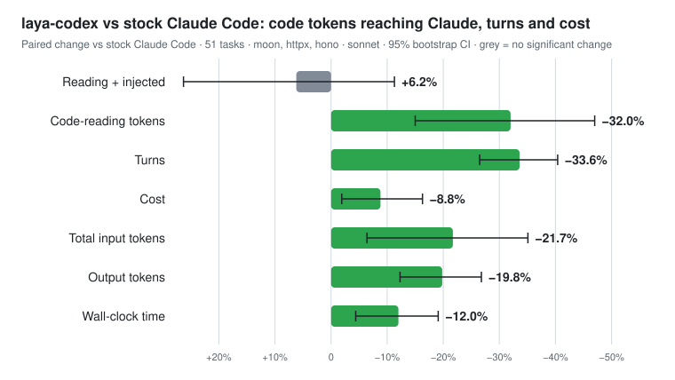

# Two benchmark bugs that hid a 14% saving

*2026-09-30 · laya-codex benchmark v13 · all data in [`bench/results/`](../../bench/results/)*

laya-codex ranks your repository's code with a small local model and hands Claude Code the right
functions with your prompt, so Claude spends less time searching. We measure that against stock
Claude Code on 60 real tasks from three open-source repositories (moon in Rust, httpx in Python,
hono in TypeScript). Every task runs in both arms with the same model, and every number is paired,
with 95% bootstrap confidence intervals.

This week the numbers went the wrong way. Chasing why turned up two bugs in our own benchmark.
Both made laya-codex look worse, or its sessions less typical, than it really is. This post covers
what we found, what the fixed benchmark says, and what did not work.

## The result

Benchmark v13: Claude Sonnet 5.5 (`claude-sonnet-5-5`) at medium effort, Claude Code 2.1.284, 60
paired tasks, two questions per task (where does this change go; which tests and callers cover
it).

| per session | stock Claude Code | with laya-codex | change (95% CI) |
|---|---|---|---|
| **Cost** | $0.128 | $0.110 | **−13.7%** (−17.8% … −9.1%) |
| **Wall-clock** | 23.2 s | 18.7 s | **−19.2%** (−23.3% … −14.7%) |
| Turns | 7.9 | 4.3 | −45.5% |
| Tool calls | 5.9 (4.2 Greps) | 2.3 (0.8 Greps) | |
| Code read + code injected | 2,755 tokens | 3,017 tokens | +9.5%, not significant |
| **Answer recall, first question** | 0.73 | 0.88 | **+0.15** (+0.08 … +0.23) |
| Answer recall, both questions | 0.95 | 0.93 | −0.02, not significant |



The right code was in Claude's context before its first turn in 52 of 60 tasks. Stock Claude
reached a right file at turn 4 in the median task, and never in 19 of them.

Two caveats up front:

- **Cost varies by repository.** It fell 22% on moon and 11% on hono. On httpx it did not change
  significantly (+4%), because stock Claude already finds httpx code in a couple of calls.
- **Our goals are not met.** We aim for −50% cost and −30% time against stock. We are at −14% and
  −19%.

## How we got here

### 1. The model under the benchmark changed

The benchmark asked for `--model sonnet` and recorded only that alias. Between benchmark v10 (27
September) and our next pilot, the alias moved from Claude Sonnet 5 to Sonnet 5.5. On Sonnet 5.5,
stock Claude reads about half as much code per session as before (about 2,000 tokens against
4,600). Our old token goal, a 50% cut in code read plus injected, no longer made sense: laya-codex
injects about 1,600 tokens on its own.

We moved the goal to **cost per session**. That is what a user pays, and it counts every token,
the injected ones included. We also pinned runs to a model id.

### 2. A full rerun said laya-codex costs *more*

Benchmark v12 re-ran all 60 tasks on Sonnet 5.5. laya-codex cut turns 44% and time 17%, and
raised first-answer recall from 0.72 to 0.90. But cost came out at **+0.6%**, and on httpx and
hono it was up 8–9%.

To see why, we priced the prompt cache. Claude Code caches the conversation for an hour. New text
is billed once as a cache write at $6 per million tokens (twice the input price). Each later turn
re-reads it at $0.30. The laya-codex sessions were writing far more new text on the follow-up
question than stock sessions: about 6,000 tokens against 760.

### 3. Bug one: resuming the session broke the cache

The benchmark sent the follow-up by resuming the session (`claude -p --resume`), a new process per
question. That is where it went wrong:

- **When it happened:** laya-codex's injected code let Claude answer the first question in a
  single API call. That happens only when the code it was given is enough.
- **What went wrong:** the resumed request rebuilt the first message differently from the one
  that was cached. The follow-up missed the cache and paid to rewrite the whole conversation.
- **How often:** 31 of 60 laya-codex sessions and **0 of 60 stock sessions**, because stock
  Claude always calls tools first.

The same two questions sent into one live session, the way you actually use Claude Code, kept the
cache:

| same task, same build | follow-up re-read from cache | follow-up new text | session cost |
|---|---|---|---|
| resumed per question (old benchmark) | 5,035 tokens | ~6,000 | $0.092 |
| one live session (fixed) | ~9,500 tokens | ~1,400 | $0.037 |

So the benchmark charged laya-codex for a cost that real sessions never pay, and charged it
exactly when laya-codex worked best. It now runs each task as one live session.

### 4. Bug two: the operator's CLAUDE.md was in every session

While reading the saved sessions, we found the benchmark operator's personal `~/.claude/CLAUDE.md`
attached as project instructions to every session in both arms, in every run we could check (back
to benchmark v10).

Claude Code reads `.claude/CLAUDE.md` in every directory above the working directory. For a repo
anywhere under your home directory, that includes your home, where the global file lives. Setting
`--setting-sources project` does not stop it, and neither did moving the repos to another folder
in the same home directory.

Both arms were affected alike, so the comparisons stand. But every session carried someone's
personal rules, about 1,300 extra tokens. The benchmark repos now live outside the home directory,
and the runner refuses any repo with a CLAUDE.md above it.

### 5. The rerun

Benchmark v13 ran with one live session per task. The result is the table at the top:
**cost −13.7%** where v12 said +0.6%.

## What did not work

We tested each of these, and each was shelved on the evidence:

- **Telling Claude more firmly to answer from the code shown.** A small pilot cut code tokens 3%,
  raised cost 8% and time 4%, and lost a right file. Not merged.
- **Showing less of each block** (18-line windows instead of whole functions). The offline replay
  looked fine, but in benchmark v11 Claude read 23% more to see the rest. Not merged.
- **Skipping the code when the model is unsure** (top probability below 0.1). This is safe: it lost
  0 of 142 right files. But it saves about 0.3% of cost. Not built.
- **Answering the follow-up's lookups up front.** On 70% of follow-ups Claude runs one `search` for
  the functions it named in its first answer. We could run that lookup for it. But picking the 2–3
  names it will look up from the ~9 it mentions covers every lookup in only 30 of 80 follow-ups,
  under 1% net. Not built.
- **Letting the model read longer code** (448 or 1,024 tokens instead of 128). It inlined no more
  right files and was slower.

## Where the cost goes now

At list prices, a laya-codex session's bill is 64% cache writes, 12% cache re-reads and 24%
output. The injected code replaces the tool output it saves roughly one for one. What laya-codex
really saves is **API calls**: 2.3 tool calls against 5.9, about $0.008 per call avoided. Most of
what remains is Claude Code's own per-session context and Claude's written answers, which both
arms pay.

Time follows output: each 1,000 output tokens adds about 7.6 s (R² 0.82), whoever found the code.

That is why we think −50% cost against stock is out of reach by changing what laya-codex injects,
and why that goal is now under review.

## If you benchmark Claude Code tools

- **Pin the model id.** `sonnet` is an alias, and it moves.
- **Run multi-question tasks in one live session.** Resuming per question can break the prompt
  cache in ways real sessions never see, and the break can fall on one arm only.
- **Keep benchmark repos outside your home directory.** Otherwise `~/.claude/CLAUDE.md` joins every
  session. Check the saved session for an `instructions` attachment.
- **Price the cache.** Cache writes cost 20× cache reads, so "fewer tokens" and "lower cost" can
  disagree.
- **Report quality, time, tokens and cost together,** so a gain on one is weighed against the
  others.

## Reproduce it

```sh
python3 bench/run_bench.py run --repo /path/outside/home/httpx --tasks bench/tasks-v8/httpx.jsonl \
  --arms "baseline,laya:laya-adaptive" --out results/httpx --model claude-sonnet-5-5 --turns 2 --effort medium
python3 bench/stats_pooled.py laya baseline results/moon results/httpx results/hono
```

- **Full report:** [docs/RESULTS.md](../RESULTS.md#benchmark-v13-2026-09-30-sonnet-55-one-live-session-per-task).
- **Raw rows:** `bench/results/claude-v13/`, and v12 in `bench/results/claude-v12/`.
- **The harness fix:** [#32](https://github.com/pilotspace/laya-codex/pull/32).
